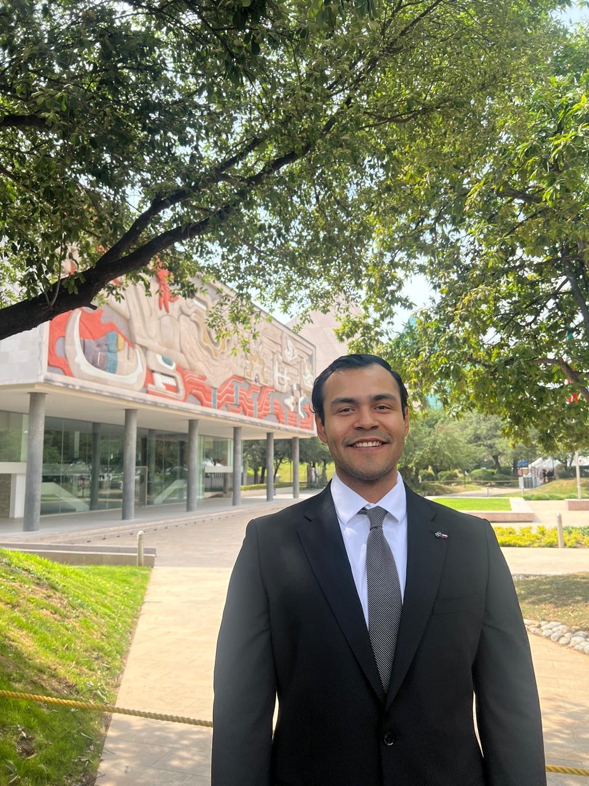

  

👋🏻 ¡Hi! I’m Roberto Damian Yáñez González  

I'm a Sustainable Development Engineer transitioning into Data Science. I'm passionate about solving real world problems through data analysis, machine learning, and visual storytelling.  
I apply Data Science to real world challenges across sectors like hospitality, tech, energy, migration, and e-commerce. My projects include price prediction, cancellation analysis, user segmentation, A/B testing, predictive maintenance, and classification models. I leverage machine learning, statistical analysis, and data visualization to deliver impactful solutions.

📍 Interested in e-commerce, finance, and sustainability 

---
## 🛠️ Habilidades Técnicas  

- Python (pandas, numpy, matplotlib, seaborn, scikit-learn, statsmodels)
- PostgreSQL: Basic to intermediate level
- Excel : intermediate
- Data Preprocessing: Data cleaning, transformation, and outlier handling
- Data Visualization: Exploratory and explanatory charts for business insights
-Statistical & Predictive Modeling: Hypothesis testing, regression (linear/logistic), classification, decision trees, A/B testing
- Machine Learning:Supervised & unsupervised models, pruning, performance metrics (precision, recall, F1-score, ROC-AUC)
- Business Problem Solving
  
  ---
## 📂 Projects
---
### 📰 A/B Testing for Landing Page Performance Optimization

- Conducted an A/B testing experiment to evaluate the impact of a redesigned landing page on user engagement and conversion rates  
- Randomly split 100 users into two groups: control (old landing page) and treatment (new landing page), collecting behavior metrics from both  
- Performed statistical analysis (at 5% significance level) to answer key questions defined by the E-news design team
- **Tools**: Python, pandas, scipy.stats, A/B Testing, hypothesis testing  
- 🔗 [View Project on GitHub](https://github.com/RDYG18)

---
### 📱 Device Resale Price Prediction

- Built a linear regression model to estimate the future resale value of electronic devices  
- Identified key price-driving features to support dynamic pricing and inventory management  
- Evaluated model performance using R² and residual analysis  
- **Tools**: Python, pandas, matplotlib, scikit-learn
<ul>
  <li><strong>🔗 <a href="https://github.com/RDYG18/-Regression-Model-to-Improve-Resale-Value-Strategy/blob/main/README.md" target="_blank" rel="noopener noreferrer">Device Resale Price Prediction</a></strong></li>
</ul>

"https://github.com/RDYG18/-Regression-Model-to-Improve-Resale-Value-Strategy/blob/main/README.md"
"https://github.com/RDYG18/-Regression-Model-to-Improve-Resale-Value-Strategy"
---

### 🏨 Hotel Booking Cancellation Prediction  

- Developed a model to predict hotel cancellations using logistic regression and decision trees  
- Applied outlier detection, variable selection (VIF, backward elimination), and threshold optimization  
- Achieved improved accuracy and business insights for reducing revenue loss  
- **Tools**: Python, pandas, scikit-learn, matplotlib  
- 🔗 [View Project on GitHub](https://github.com/RDYG18)

---

### ⚙️ Predictive Maintenance for Wind Turbines

- Developed classification models to predict generator failures in wind turbines using environmental and sensor-based component data  
- Utilized a dataset with 40 predictors, 20,000 training observations, and 5,000 test observations shared in a ciphered format due to confidentiality  
- Conducted model tuning and evaluation to find the best-performing classifier to enable preventive actions before failures occur  
- Focused on minimizing false negatives to reduce high replacement costs while maintaining balance with repair and inspection actions cost 
- **Tools**: Python, pandas, scikit-learn, classification models, hyperparameter tuning, confusion matrix  
- 🔗 [View Project on GitHub](https://github.com/RDYG18)

## 📫 Contact  

- GitHub: [RDYG18](https://github.com/RDYG18)  
- LinkedIn: [linkedin.com/in/roberto-yanez](https://www.linkedin.com/in/roberto-yanez)  
- Email: roberto.yanezg18@gmail.com

---
